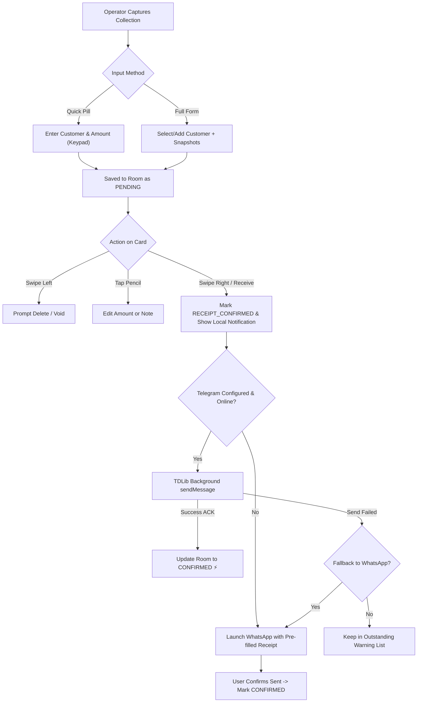
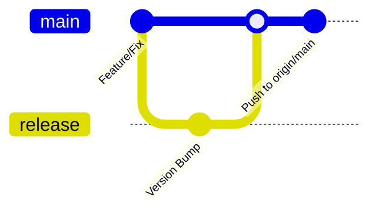

# CollectFlow: Operational Workflows & Development Plan

This document outlines the operational user workflows, testing procedures, release pipelines, and future development plans for **CollectFlow**.

---

## 1. End-to-End Operational Workflows

---

### Workflow 1: Rapid Cash Collection & Auto-Send
1. **Trigger:** The operator collects cash in the field and taps the bottom floating pill **`QUICK CAPTURE`**.
2. **Entry:** 
   - Types or searches the customer name.
   - Types amount on the custom on-screen keypad. Commission is computed in real-time.
   - Taps **SAVE**.
3. **Receipt State:** Item is immediately persisted in SQLite (`status = PENDING`). Home screen widget updates instantly.
4. **Confirmation & Dispatch:**
   - On the collection card, operator **swipes right (start-to-end)**.
   - App emits haptic feedback, displays green confirmation background, and transitions status to `RECEIPT_CONFIRMED`.
   - Low-latency Android notification is displayed with receipt summary.
   - If Telegram auto-send is enabled and online, TDLib sends the receipt background message directly to the recipient without opening Telegram.
   - Upon TDLib server confirmation (`UpdateMessageSendSucceeded`), the Room status transitions to `CONFIRMED`.
   - If Telegram fails or is disabled, WhatsApp opens with the pre-formatted text automatically.

---

### Workflow 2: Telegram Account QR Pairing & 2FA Setup
1. **Configuration:**
   - Operator goes to **Settings** (`[ SETTINGS ]` tab).
   - Enters `API ID` and `API HASH` (obtained from `my.telegram.org`).
   - Enters `RECIPIENT` (e.g. `@brother_username` or phone number).
   - Toggles **Enable Telegram Send** and **Fallback to WhatsApp**.
   - Taps **SAVE CONFIG**.
2. **QR Pairing:**
   - Taps **SCAN QR**.
   - A high-contrast QR code modal appears on screen.
   - Operator opens Telegram on their personal phone: `Settings → Devices → Link Desktop Device` and scans the QR code.
3. **2FA Verification (if enabled on account):**
   - If 2-step verification is enabled, a password prompt appears.
   - Operator enters their cloud password and taps **SUBMIT**.
4. **Ready State:**
   - TDLib initializes encrypted storage and enters `Ready` state.
   - The status badge turns green: `[ ONLINE ]`.
   - Operator taps **TEST SEND** to verify background delivery to their brother.

---

### Workflow 3: Daily Monitoring via Central Dashboard
1. **Navigation:** Tap **`[ DASHBOARD ]`** in the exact center of the bottom navigation bar.
2. **Metrics:**
   - **Today's Total:** Large headline metric showing total collections since 00:00 local time.
   - **Commission Earned:** Total operator margin earned today.
   - **Active Entries:** Number of collections completed today.
   - **Dispatch Status:** Live status pill showing Telegram background connection health.
3. **Alerts:**
   - Warning banner if there are unsent receipts (`RECEIPT_CONFIRMED` but pending delivery).
4. **Direct Actions:**
   - One-tap **`+ QUICK`** shortcut.
   - One-tap **`EXPORT CSV`** to export filtered today records.
   - Stream of recent 5 collection events with status badges.

---

### Workflow 4: Voiding, Editing, and Deleting Entries
1. **In-Place Edit:**
   - Tap the **Pencil Icon** on any pending collection card.
   - The `EditCollectionBottomSheet` slides up with the Nothing-style numeric keypad.
   - Update amount or note and tap **SAVE CHANGES**.
2. **Swipe to Delete / Void:**
   - **Swipe left (end-to-start)** on a collection card.
   - Red indicator reveals `DELETE / VOID`.
   - Confirmation dialog prompts: *"Are you sure you want to delete collection of ₹X for Y?"*.
   - Confirming permanently removes or voids the entry and refreshes home screen widgets.
3. **Audit Replacement (for committed receipts):**
   - Open collection details from History.
   - Choose **Void & Replace**: requires entering a reason (e.g. *"Wrong amount entered"*), stores original ID in `replaces_id`, and creates the replacement receipt.

---

## 2. Release & CI/CD Pipeline

### Automated CI Pipeline (`.github/workflows/build-apk.yml`)
1. **Trigger:** Pushes to `main` or manual trigger via `workflow_dispatch`.
2. **Environment:** Ubuntu Runner with Temurin JDK 17.
3. **Dependency Verification:**
   - Verifies `app/libs/core-release.aar` (TDLib arm64 native binary).
   - If missing on runner, downloads directly from official release releases.
4. **Unit Tests:** Executes `testDebugUnitTest` checking currency math, parser, and state machine.
5. **Compilation:**
   - `assembleDebug`: Generates unminified debug APK.
   - `assembleRelease`: Generates R8-minified release APK with ProGuard keep rules for TDLib and ZXing.
6. **Artifact Delivery:**
   - Uploads `CollectFlow-APKs` artifact (retained for 30 days).
   - Publishes GitHub Release with download links for `CollectFlow-debug.apk` and `CollectFlow-release.apk`.

---

## 3. Pre-Flight Verification Checklist

Before releasing or delivering changes, verify the following:

| Item | Requirement | Verification Command / Check |
|---|---|---|
| **16KB Alignment** | `libtdjni.so` LOAD segments aligned to 16,384 (`0x4000`) | `readelf -l app/libs/core-release.aar` |
| **ABI Filtering** | APK only bundles `arm64-v8a` native code | `app/build.gradle.kts` specifies `abiFilters += listOf("arm64-v8a")` |
| **Keystore Key** | TDLib DB key stored in Android Keystore | Check `TelegramManager.getOrCreateDatabaseKey()` |
| **Crash-Proof Startup** | App opens cleanly without LocalLifecycleOwner crash | Verified in `MainActivity.setContent` |
| **Database Migration** | DB version bumped with valid migration path | `AppDatabase.kt` Room migration version matches schema |
| **WhatsApp Fallback** | Opens WhatsApp if Telegram disabled or offline | Verified in `CollectViewModel.confirmReceive` |
| **Widget Sync** | Widgets refresh immediately on collection add/update/delete | `CashCollectWidgetProvider.notifyDataChanged()` called |

---

## 4. Strategic Roadmap & Future Milestones

### Milestone 1: Enhanced Widgets (Target: Next Sprint)
- Add 4x1 horizontal compact glance widget showing today's progress and quick-tap capture button.
- Add Nothing OS lock screen glance widget support.

### Milestone 2: Automated Local Backups (Target: Q4 2026)
- Daily background encrypted SQLite snapshot via WorkManager to user-selected SAF folder or SD card.
- Optional WebDAV / Google Drive auto-sync for encrypted backup zip files.

### Milestone 3: Wear OS Companion (Target: Q1 2027)
- Standalone Nothing Watch / Wear OS companion app for 1-tap quick capture from the wrist.
