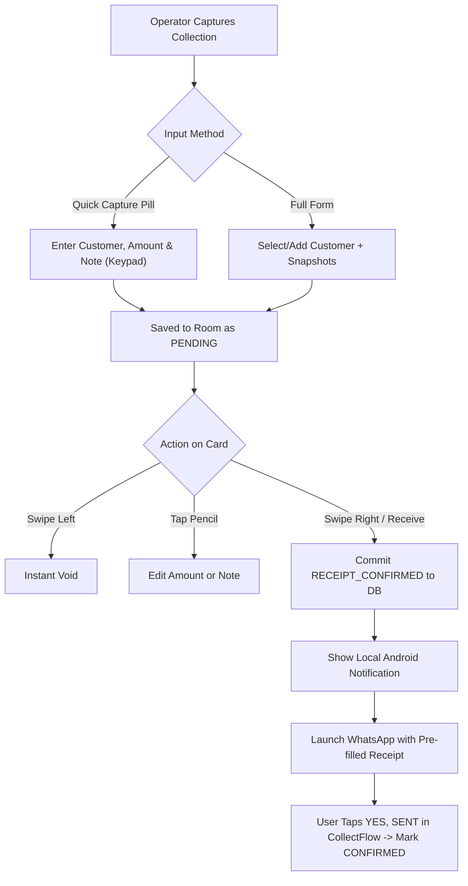

# CollectFlow: Operational Workflows & Development Plan

This document outlines the operational user workflows, testing procedures, release pipelines, and architecture for **CollectFlow**.

---

## 1. End-to-End Operational Workflows

---

### Workflow 1: Rapid Cash Collection & WhatsApp Dispatch
1. **Trigger:** The operator collects cash in the field and taps the floating **`QUICK CAPTURE`** pill.
2. **Entry:** 
   - Types or searches the customer name.
   - Types amount on the custom on-screen numeric keypad. Commission is computed in real time.
   - Taps **SAVE**.
3. **Receipt State:** Item is immediately persisted in SQLite (`status = PENDING`). Home screen widgets update instantly.
4. **Confirmation & Dispatch:**
   - On the collection card, operator **swipes right (start-to-end)**.
   - App emits haptic feedback, displays green confirmation background, and commits `status = RECEIPT_CONFIRMED` to the database.
   - Low-latency Android notification is displayed with receipt summary.
   - WhatsApp launches with the pre-formatted receipt message pre-filled.
   - Upon return, the operator confirms delivery and the entry transitions to `CONFIRMED`.

---

### Workflow 2: Immediate Voiding & Replacements
1. If an operator makes an entry mistake, they can **swipe left** on the card to instantly void it.
2. If voiding with an audit trail and replacement amount is needed, the operator taps into the **Detail** screen, enters the correction reason, specifies the replacement amount, and taps **Void & Replace**. The original entry is preserved as `VOIDED` with an audit link to the new replacement.

---

### Workflow 3: End-of-Day Insights & CSV Reconciliation
1. **Insights:**
   - Operator taps `[ INSIGHTS ]` tab to see today's realized revenue, realized commission, and pending collections.
2. **History & CSV Export:**
   - Operator taps `[ HISTORY ]` tab.
   - Can filter by status (`PENDING`, `UNSENT`, `CONFIRMED`, `VOIDED`) or search by customer name.
   - Taps `[ EXPORT CSV ]` to share an encrypted or plaintext CSV directly to WhatsApp, Drive, or local storage.
